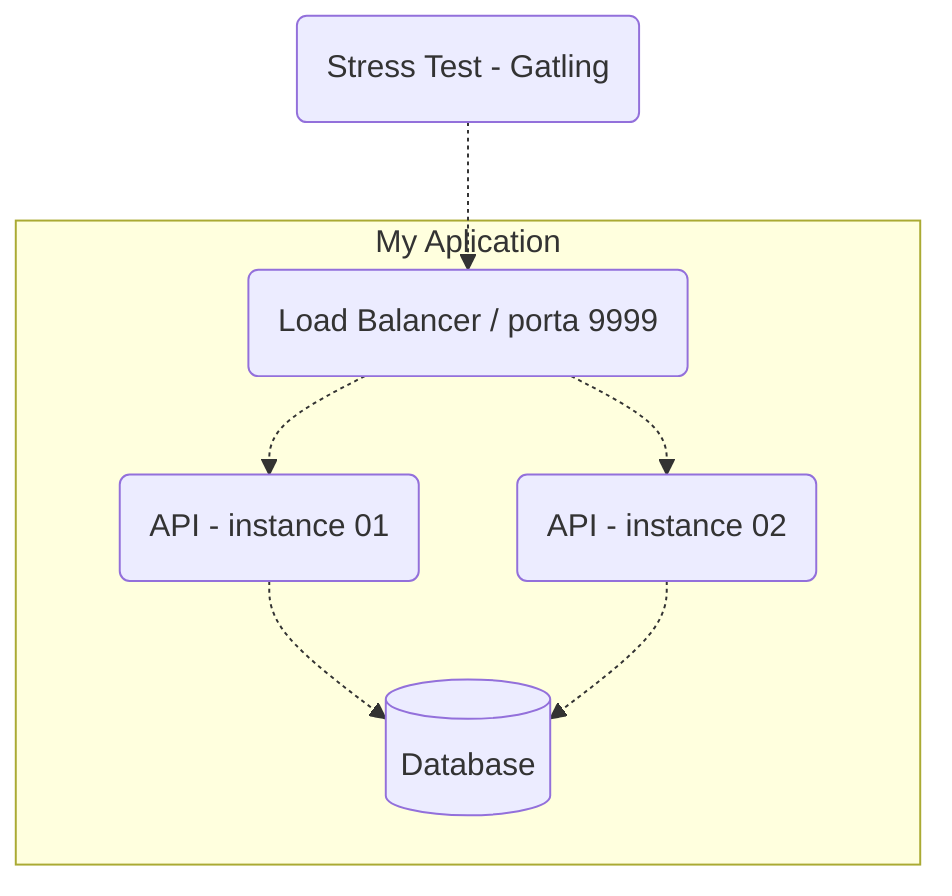

# crebitoapi

In this repository, an API was developed that was used to take part in the "2024/q1 Backend Challenge", a friendly competition on concurrency control with the theme of credits and debits (*crebito*).

To develop this project, the **golang** language was chosen, using only the **net/http** packages to make requests and **pgx** package to make transactions with the postgres database. This project also has the following structure:

It should be noted that an **nginx** image was chosen to implement the load-balancer.

This api was developed for didactic purposes, where it was possible to learn about golang development in combination with the use of docker for its execution. It was also implemented with the aim of taking part in a friendly competition in the Brazilian development community.

For more details on the competition: *https://github.com/zanfranceschi/rinha-de-backend-2024-q1*